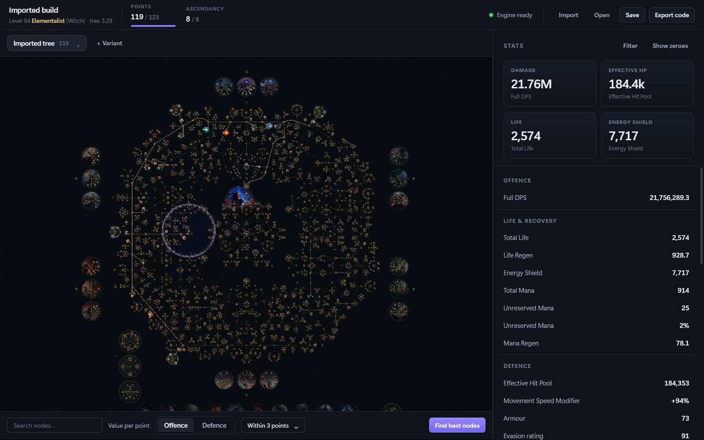
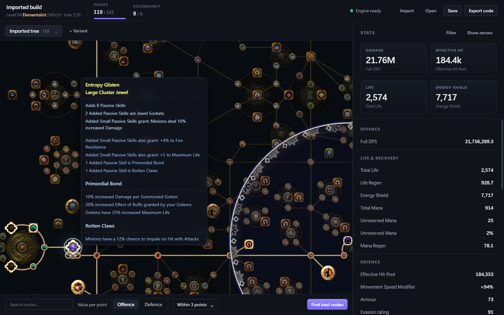
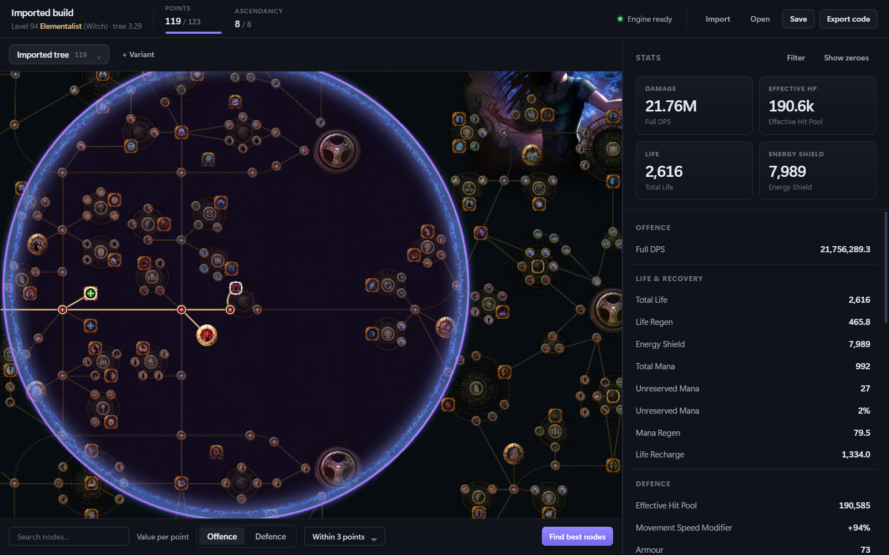
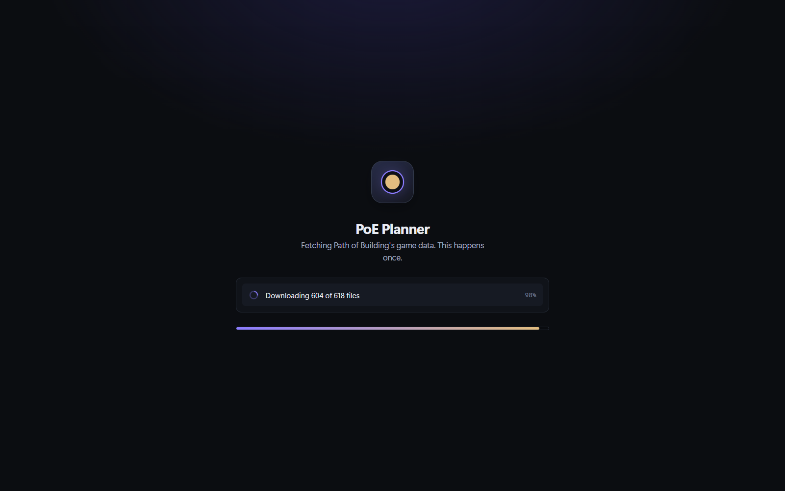

# Astrolabe

A tree-first build planner for Path of Exile. It runs Path of Building's own
calculation engine — a decade of validated combat maths — behind a modern
interface built around the passive tree.



The numbers are Path of Building's, to the decimal. Loading the same build in
both gives the same Full DPS, life, resistances and effective hit pool, because
it is literally the same engine: PoB's Lua, embedded headless and driven over
JSON-RPC.

## What it does

- **Pan, zoom and plan** a 2,900-node tree at 60 fps, with shift-click path
  tracing, search, and value-per-point heatmaps that stream nearest-first
- **Live stats** on every edit, recomputed in ~80 ms
- **Import** from a Path of Building code, a paste-site link (pobb.in,
  pob.codes, Maxroll, poe.ninja, Pastebin, Rentry, poedb.tw), a `.xml` file, or
  a live character off your Path of Exile profile
- **Tree variants** side by side, with compare-against overlays
- **Game data that stays current** — tracked from PoB's own release manifest

### Jewels get the same treatment as the tree

Timeless jewels rewrite the nodes inside their radius. Astrolabe renders the
replacements with their real artwork, draws each jewel's ornate radius ring, and
shows the whole item on the socket — including the seed line that decides what a
timeless jewel actually does.

<p align="center">
  
  
</p>

## Installing

Grab the installer from [Releases](../../releases). It is about 5 MB.

On first run the app downloads Path of Building's game data — roughly 240 MB,
about 25 seconds — and keeps it in your app data directory.



**You do not need Path of Building installed.** The data is the MIT-licensed
Lua, passive trees and mod definitions from PoB's public repository; the app
fetches them directly.

### Where the game data comes from, and why it is not bundled

PoB's game data cannot be extracted from the game without a Windows box, a
self-built Oodle extractor, and a human reviewing the diffs. The PoB Community
maintainers do that work every league and publish the result as a SHA1-indexed
file tree on GitHub.

So Astrolabe tracks *them*, not the game. It reads the same `manifest.xml` PoB's
own updater reads, diffs it by SHA1, and pulls only what changed. Bundling the
data instead would mean a 600 MB installer that goes stale the moment GGG
touches the tree — this way, league-day updates arrive on their own, along with
the calculation fixes that accompany them.

## Building from source

Requires Rust, Node 20+, and a Path of Building checkout beside this repo (or
`POB_PATH` pointing at one).

```bash
git clone https://github.com/PathOfBuildingCommunity/PathOfBuilding ../PathOfBuilding
npm --prefix app install
npm --prefix packages/tree-renderer install
cd src-tauri && cargo tauri build
```

`fixtures/*.json` is gitignored because it is generated. Regenerate it before
running the frontend against the browser mock:

```bash
cd engine-host && cargo test --release --test fixtures
```

## Why not rebuild the engine

Measured on the PoB checkout:

| | |
|---|---|
| Repo | 1.9 GB, 5.05M lines Lua, 9,378 commits, 398 contributors, 2016 → today |
| UI code (replaceable) | ~36–40k lines |
| Engine + domain (kept) | ~50k lines |
| `ModParser.lua` | 6,954 lines, **4,209 patterns**, ~2,100 bespoke special cases |

`ModParser` maps English mod text to modifiers. Each entry encodes a
reverse-engineered mechanics decision *plus every historical wording GGG has
used*, because legacy items keep old wordings alive forever. It takes 70–180
commits a year and has no external source to copy from. A planner whose numbers
are 5% wrong is worse than no planner.

## Correctness

`engine-host` embeds LuaJIT via Rust `mlua`, boots PoB headless, and runs
**515 of 517** of PoB's own regression specs.

```bash
cd engine-host
cargo build --release
./target/release/engine-host.exe specs
```

The 2 failures are trade-API specs (`TestTradeQueryRequests`), where the spec
stubs `launch.DownloadPage` with a non-method signature while the caller uses
`:`, shifting every argument. Trade integration is out of scope, and nothing in
the calc path touches it.

Green includes everything that matters for correctness: `TestOffence`,
`TestDefence` (46), `TestSkills` (26), `TestTriggers` (60), `TestItemParse` (87),
`TestAilments`, `TestImpale`, `TestBifurcatedCrit`, `TestImport`.

### Do not use the golden build snapshots as a gate

`engine-host.exe golden` runs `spec/TestBuilds/3.13/*` and reports ~899 of 2,164
stats mismatched. **This is expected.** Those snapshots were last regenerated
**2022-08-09** against game version 3.13, while the engine is at 3.29 and
changed as recently as 2026-08-06 — four years of mechanics changes. PoB's own
CI excludes them (`.busted` sets `exclude-tags = "builds"`). The mode is kept
for information only.

## Measured costs

Release build, 2,237-node tree:

| Operation | Cost |
|---|---|
| Host boot | 4.2 s |
| `build.load` (first time for a tree version) | ~5.0 s |
| Full recompute `calcsTab:BuildOutput()` | **78 ms** |
| `getNodeCalculator` setup | 15 ms |
| One node evaluation | **~9 ms** |
| Whole-tree heatmap (2,237 nodes) | **~18 s** |

Those last two decide the heatmap design: a brute-force pass is not
interactive, which is why PoB hides its heatmap behind a max-depth control.
Nodes within a few points of the current tree are ~100–300 evaluations ≈ 1–3 s,
and they are the ones that matter — so results stream ordered by path distance.

## Layout

```
engine-host/        Rust + embedded LuaJIT hosting PoB's engine
  lua/bootstrap.lua   lua-utf8 shim, package.path, boots HeadlessWrapper
  lua/busted.lua      minimal busted stand-in, so PoB's specs run here
  lua/spec_runner.lua the regression gate
  lua/bench.lua       primitive cost measurements
schema/rpc.d.ts     the frontend ↔ engine contract
packages/tree-renderer/   PixiJS passive tree (WebGL)
app/ + src-tauri/   Tauri desktop shell and panels
tools/updater/      tracks PoB's manifest to keep game data current
```

## Boot requirements (learned the hard way)

- **LuaJIT specifically.** `Common.lua:18-20` uses `bit.*` at module scope, so
  plain Lua 5.1 needs luabitop and 5.3+ will not work.
- **`lua-utf8`** is hard-required with no fallback (`Common.lua:29`), but the
  whole codebase uses only six of its functions across 16 call sites, so a
  pure-Lua shim suffices.
- **The `debug` library must be loaded.** `mlua`'s `Lua::new()` omits it;
  PoB needs `debug.traceback` at `ItemsTab.lua:4329` — the only `debug.*` call
  site in 5M lines.
- **`arg` must exist.** `Main.lua:68` reads `arg[1]` as a build URL to import;
  an embedded interpreter does not set it, so `arg = {}` is required.
- **cwd must be PoB's `src/`** — `HeadlessWrapper.lua` does a relative
  `dofile("Launch.lua")`.
- **`src/HeadlessWrapper.lua` ships in no PoB release.** It exists only in the
  repository, so the updater fetches it alongside the manifest — without it a
  vendored copy has no entry point at all.
- If the vendored LuaJIT build fails with `'minilua' is not recognized`, clear
  `NoDefaultCurrentDirectoryInExePath` for that shell invocation.

## Upstream

Path of Building is **never modified**. Our patches load after
`HeadlessWrapper.lua`, so upstream updates stay a fast-forward.

## Licence

MIT — see [LICENSE](LICENSE).

Path of Building Community is also MIT licensed; see [NOTICE.md](NOTICE.md) for
its copyright and licence text. This project is not affiliated with Grinding
Gear Games or with the Path of Building Community team.
